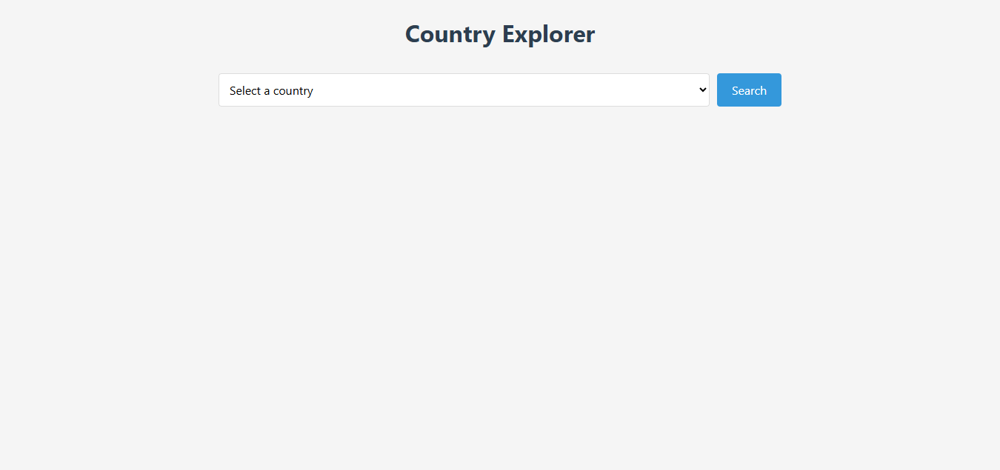
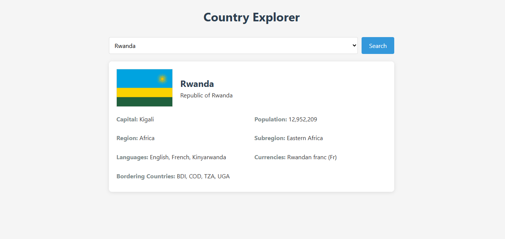

# Country Explorer

Country Explorer is a web application that allows users to explore information about countries around the world. Users can select a country from a dropdown menu and view detailed information such as the country's flag, capital, population, region, subregion, languages, currencies, and bordering countries.

## Features

- Fetches and displays a list of countries in a dropdown menu.
- Displays detailed information about a selected country.
- Includes a loading spinner to indicate data fetching.
- Handles errors gracefully with user-friendly messages.
- Responsive design for mobile and desktop devices.

## Technologies Used

- **HTML**: Structure of the web application.
- **CSS**: Styling and layout of the application.
- **JavaScript**: Logic for fetching and displaying country data.
- **REST API**: Data fetched from [REST Countries API](https://restcountries.com/).

## Links
- **Demo Video**: [Demo Video](https://youtube.com/shorts/34O5KsOoGF8?si=GMBP1dRgXuTQXzm9)
- **Live Site**: [Country Explorer](https://www.ahmed-101.tech/)
- **Repository**: [GitHub Repository](https://github.com/ahmed101-uni/web-inf-summative-project/tree/main)

## Usage

1. Open the application in your browser.
2. Select a country from the dropdown menu.
3. Click the "Search" button to view detailed information about the selected country.
4. If no country is selected, an error message will prompt you to select one.

## Project Structure

```
/
├── index.html       # Main HTML file
├── styles.css       # CSS file for styling
├── script.js        # JavaScript file for functionality
├── README.md        # Project documentation
```

## Setup Instructions

### Local Setup

1. Clone the repository or download the project files.
   ```bash
   git clone https://github.com/ahmed101-uni/web-inf-summative-project.git
   ```
2. Navigate to the project directory.
   ```bash
   cd web-inf-summative-project/
   ```
3. Open the `index.html` file in your browser to run the application.

### Server Setup

1. **Install nginx**
```bash
sudo apt-get update
sudo apt-get install nginx -y
```

2. **Clone the repository in /var/www/html/**
```bash
cd /var/www/html/ 
sudo git init
sudo git remote add origin https://github.com/ahmed101-uni/web-inf-summative-project.git
sudo git pull origin main
```

3. **Restart nginx**
```bash
sudo service nginx restart
```

## API Reference

This project uses the [REST Countries API](https://restcountries.com/) to fetch country data.

- **Get all countries**: `https://restcountries.com/v3.1/all`
- **Get country details by code**: `https://restcountries.com/v3.1/alpha/{code}`

## Screenshots

### Main Interface


### Country Details



## Deployment Process

### Load Balancer (HAProxy)

1. Install HAProxy on the server.
2. Update the configuration file to manage incoming requests and distribute them across the available web servers.
3. Create an SSL certificate for the domain to enable secure HTTPS connections.
4. Modify the configuration file to handle HTTPS traffic and redirect HTTP requests to HTTPS.
5. Restart the HAProxy service to apply the changes.

### Web Servers (Nginx)

1. Perform the initial setup and configuration of Nginx.
2. Navigate to `/var/www/html/`, initialize a Git repository, set the remote origin to `https://github.com/ahmed101-uni/web-inf-summative-project.git`, and pull the project files from the repository.
3. Restart the Nginx service to ensure the changes take effect.

## Challenges

Developing the Country Explorer involved challenges like dynamically fetching and sorting dropdown data, designing a user-friendly interface, handling API errors gracefully, optimizing performance for large datasets, and ensuring consistent behavior across browsers and devices.

## Acknowledgments

- [REST Countries API](https://restcountries.com/) for providing the country data.
- Inspiration from various country explorer applications.
